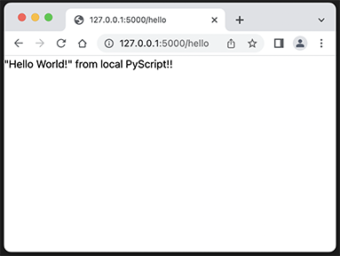

# PyScript and my journey to the Web

## Slides

The `gh-pages` branch of this repo contains the slides for **PyScript and my journey to the Web**. The presentation contents are licensed under [CC-BY-4.0](https://choosealicense.com/licenses/cc-by-4.0/). The slides are available at [https://sjirwin.github.io/pyscript-journey/](https://sjirwin.github.io/pyscript-journey/) and are rendered using [reveal.js](https://revealjs.com) via GitHub pages.

## Code

The `main` branch contains code that was written as part of my PyScript journey. Any code in this repo authored by me is covered by the [MIT license](https://choosealicense.com/licenses/mit/).

The repo does contain some code obtained from various open source projects (e.g., PyScript). That code is covered by the original projects' licenses.

**Direct Dependancies**
  - [PyScript](https://pyscript.net/)
  - [Pyodide](https://pyodide.org/en/stable/)
  - [Flask](https://flask.palletsprojects.com/en/2.2.x/)

### Code Layout

- `hello_world` : a very basic "Hello World" web page implemented using **PyScript**. You should be able to load this directly into your browser via `File` -> `Open` (i.e., no web server should be needed). An internet connection is required since the page will dynamically download **PyScript** and **Pyodide**. **Pyodide** in particular is quite large (281 Mb as of this writing) so if you are not blessed with a fast internet connection, the page might take some time to load and render.
- `flask-hello_world` : a trivial **Flask** app used to verify that **Flask** is installed correctly.
- `server` : the main **Flask** app. This has been configured to use a local, static copy of **PyScript** and **Pyodide**. The **PyScript** files are included in this repo and reside in `server/static/pyscript` (these were copied from [pyscript.net/alpha](https://pyscript.net/alpha) on 2022-Aug-07). Given its size, **Pyodide** is not included and must be downloaded from its [releases page](https://github.com/pyodide/pyodide/releases) (details below).

### Web Server Set Up

I used Python 3.10 during development. However any modern, supported version of Python should work (_"Your milage may vary"_).

#### Install in a virtual environment

- Create a virtual environment and install **Flask** (assumes `pip` is installed)
```sh
python3.10 -m venv .venv
source .venv/bin/activate
pip install -r requirements.txt
```

#### Verify that the web server works

- Test that the web server is installed and works on `localhost`
```sh
cd flask-hello_world
flask run --port 5050 # avoid standard port
```
- Check that the flask app works on [localhost](http://127.0.0.1:5050/)


### Pyodide and PyScript as static resources

- **PyScript** : as mentioned above, the **PyScript** files are included in this repo. They reside in `server/static/pyscript`
- **Pyodide** : because of its size, **Pyodide** is not included and must be downloaded from its [releases page](https://github.com/pyodide/pyodide/releases). The code in this repo assumes version 0.21.0.
  - Download version [0.21.1](https://github.com/pyodide/pyodide/releases/download/0.21.1/pyodide-build-0.21.1.tar.bz2) from the GitHub releases page
  - Unpack the `tar.bz2` file
  - Move the `pyodide` directory to `server/static`
- Verify that everything is working
  - Start the server  (assumes venv is still active)
```sh
cd server
flask run
```
   - Load the [hello page](http://127.0.0.1:5000/hello) from `localhost`



