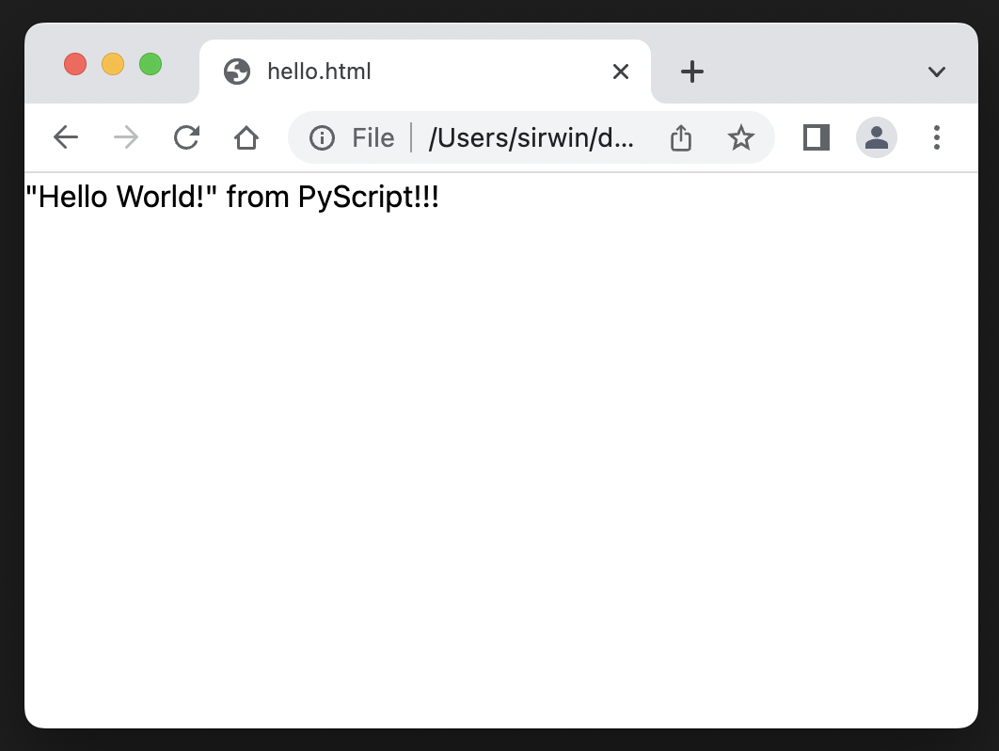
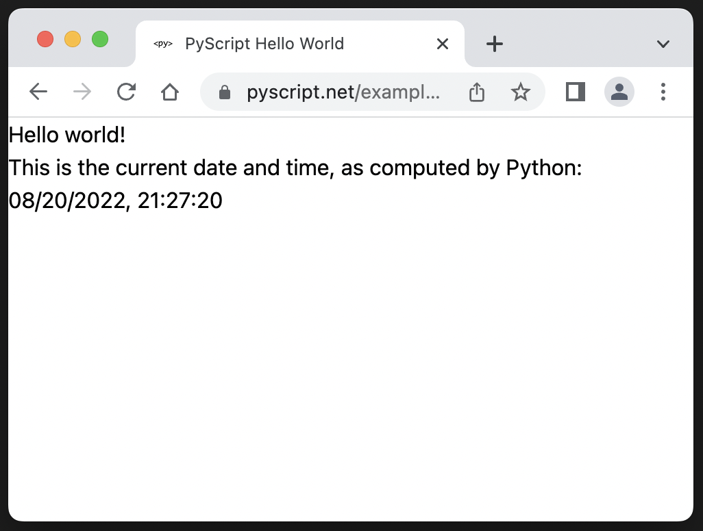
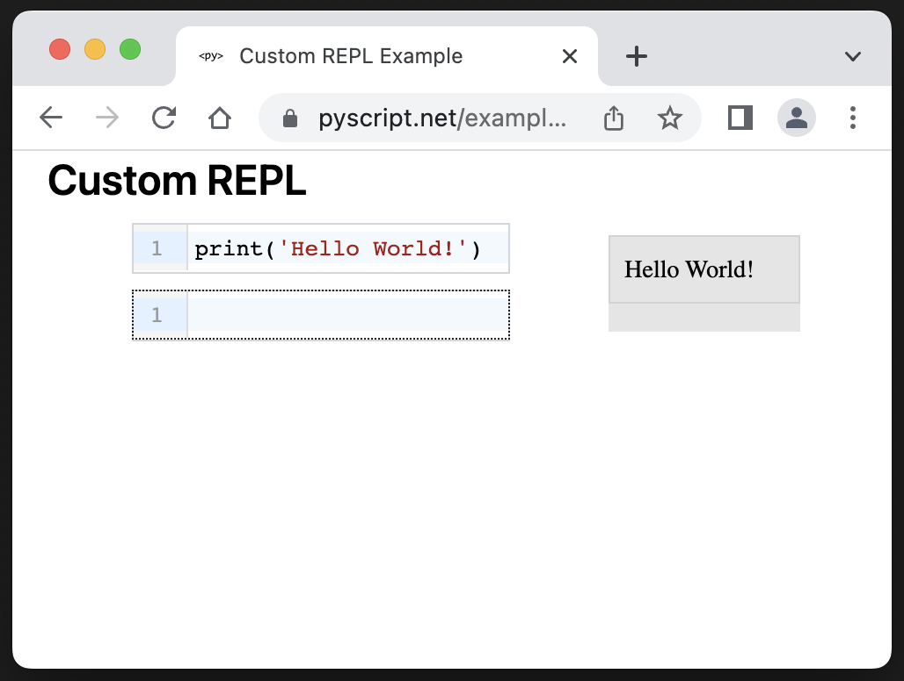
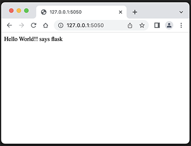
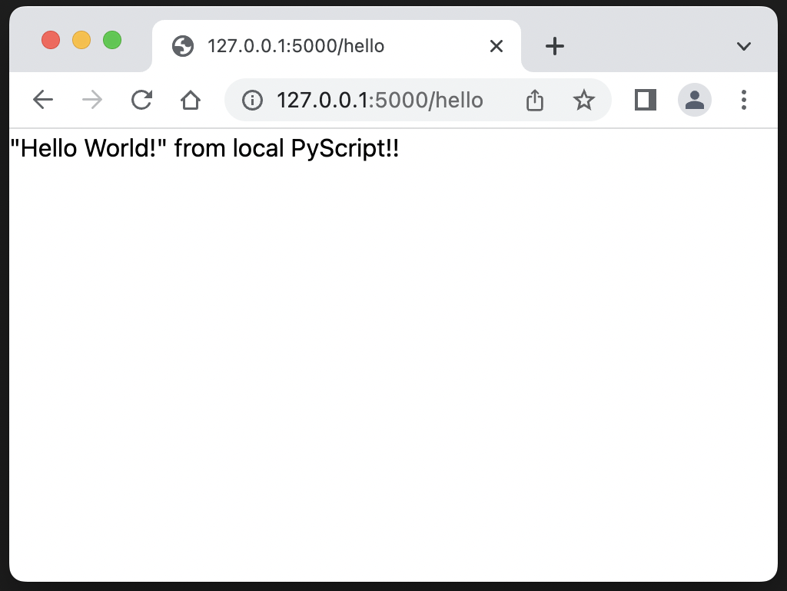

## PyScript and my journey to the Web

<span style="font-size:smaller">PyCon UK 2022</span>
<center>
Scott Irwin<br/>
<br/>
<br/>
<p>&nbsp;<p>
https://sjirwin.github.io/pyscript-journey/
</center>

------

## About Me

- Bloomberg
  - Joined in 2014 as Senior engineer and manager
  - Python educator
  - Python Guild Leader since 2018
    - Co-chair since 2021
- No previous experience developing Web applications

---

# PyScript
## The Journey Inspired

------

## PyScript

- Announced at PyCon US 2022 ([video](https://www.youtube.com/watch?v=qKfkCY7cmBQ))
- Enables using Python in client-side web apps
- Built on top of
  - [Pyodide](https://pyodide.org/en/stable/)
  - [WebAssembly](https://webassembly.org/) (WASM)

------

## Some PyScript Features

- Bi-directional communication between Python and Javascript objects and namespaces
- Curated set of ready to use UI components, such as buttons, containers, text boxes
- Can use many popular Python packages
  - Including many from the scientific stack (e.g., NumPy, Pandas, Matplotlib)
  - Check [pyodide/packages](https://github.com/pyodide/pyodide/tree/main/packages) for the full list

------

## Words of Caution

- <span style="color:orangered">**Not recommended**</span> for production use
- PyScript is "very alpha" and under heavy development
- Many known issues, from usability to loading times

---

# Hello World

------

## DIY

- Create `hello.html`
- Add `<head>` section that brings in `pyscript`
``` html
<head>
 <link rel="stylesheet" href="https://pyscript.net/alpha/pyscript.css"/>
 <script defer src="https://pyscript.net/alpha/pyscript.js"></script>
</head>
```
- Add `<body>`section which includes Python code in a `<pyscript>` section
 ``` html
<body>
 <py-script>print('"Hello World!" from PyScript!!!')</py-script>
</body>
 ```

------

## DIY Result



------

## PyScript Demos

[https://pyscript.net/examples/](https://pyscript.net/examples/)

- Hello World<br/>


------

## PyScript Demos - REPL

```html
<py-repl id="my-repl" auto-generate="true"> </py-repl>
```
- [example repl](https://pyscript.net/examples/repl.html)
- [example repl2](https://pyscript.net/examples/repl2.html)
<br/>


---

# Web Server

------

## Initial Set Up

- Create a virtual environment and install Flask
```sh
python3.10 -m venv .venv
source .venv/bin/activate
pip install flask
```
- Create (yet another) "Hello world" app as a quick test
     - No PyScript (yet)
<br/>


------

## Static Assets - PyScript & Pyodide

- Up till now **PyScript** and **Pyodide** needed to be downloaded each time from their respective servers
- Useful to have these assets local to the web server
  - Slow internet connections
  - Offline mode
  - Stable versions

------

## PyScript

- Downloaded individually from `https://pyscript.net/alpha`
- Essential files
  - `pyscript.js`
  - `pyscript.min.js`
  - `pyscript.css`
  - `pyscript.py`
- Optional files
  - `pyscript.js.map`
  - `pyscript.min.js.map`

------

## Pyodide

- Downloaded from their [releases site](https://github.com/pyodide/pyodide/releases)
- Uncompressed size of version 0.21.0 was 281 Mb

------

## Connecting the Pieces

- Update `<head>` to reference the static `pyscript`
```html
 <link rel="stylesheet" href="/static/pyscript/pyscript.css"/>
 <script defer src="/static/pyscript/pyscript.js"></script>
```
- Add `<pyconfig>` section for **Pyodide**
```html
    <py-config>
        - autoclose_loader: true
        - runtimes:
            -
                src: "/static/pyodide/pyodide.js"
                name: pyodide-0.21
                lang: python
    </py-config>
```

------

## Connecting the Pieces (cont)

- Move the code to a `.py` file
- Need a `<py-env>` to set import path
```html
    <py-env>
        - paths:
            - /static/python/hello.py
    </py-env>
```
- Update `<py-script>` to get source from the `.py` file
```html
<py-script src="/static/python/hello.py"></py-script>
```

------

## Final Result



------

## An Important "Thank You!"

- **PyScript** is an alpha product
  - Early in my explorations was concerned about isolation
  - Started thinking about how to make **PyScript** local
- Then encountered a mind-expanding YouTube course
  - [_"Python Web Apps, Running Locally with pyscript"_](https://www.youtube.com/watch?v=lC2jUeDKv-s)
  - Developed by Michael Kennedy (host of [_Talk Python To Me Podcast_](https://talkpython.fm/home))
  - Showed how to make **PyScript** and **Pyodide** static assets

---

# A Real Application

------

## Mortgage Calculator

- First "real" web application usually is a to-do list
  - Not very interesting
  - Not very useful
  - [pyscript/examples](https://github.com/pyscript/pyscript/tree/main/examples) already has two implementations
- Decided to implement a mortgage calculator instead
  - There are a lot of these on the web so obviously useful
  - Needs both input and output
  - Can be implemented as a single-page web app