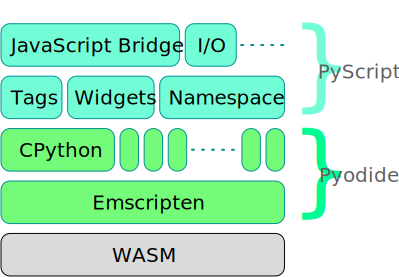

## PyScript and my journey to the Web

<center>
Scott Irwin<br/>
<br/>
<p>&nbsp;<p>
https://sjirwin.github.io/pyscript-journey
</center>

------

## About Me

- Bloomberg
  - Joined in 2014 as Senior engineer and manager
  - Python educator
  - Python Guild Leader since 2018
    - Co-chair since 2021
- No previous experience developing Web applications

---

# The Journey Inspired

------

## PyScript

- Announced at PyCon US 2022 ([video](https://www.youtube.com/watch?v=qKfkCY7cmBQ))
- Project home page at [https://pyscript.net/](https://pyscript.net/)
 - Enables using Python code in client-side web apps
     - Python directly in the html
- Built on top of
  - [Pyodide](https://pyodide.org/en/stable/)
  - [WebAssembly](https://webassembly.org/) (WASM)

------

## PyScript Tech Stack



------

## WebAssembly

- Binary instruction format for a stack-based virtual machine
- WebAssembly 1.0 shipped in "major" browsers
  - Chrome
  - Edge
  - Firefox
  - WebKit (Safari)

------

## Pyodide


- Port of CPython to WebAssembly/Emscripten
- Enables installing and running Python packages in the browser
  - Uses [micropip](https://pyodide.org/en/stable/usage/api/micropip-api.html)
- Supports pure Python packages with a wheel available on PyPI
- Many packages with C extensions have also been ported
  - General: regex, pyyaml, lxml
  - Scientific: numpy, pandas, scipy, matplotlib, scikit-learn
- Check [pyodide/packages](https://github.com/pyodide/pyodide/tree/main/packages) for the full list

------

## Some PyScript Features

- Bi-directional communication between Python and Javascript objects and namespaces
- Curated set of ready to use UI components, such as buttons, containers, text boxes
- Because it uses Pyodide, you can use many popular Python packages

------

## Words of Caution

- <span style="color:orangered">**Not recommended**</span> for production use
- PyScript is "very alpha" and under heavy development
- Many known issues, from usability to loading times

---

# Hello World

------

## DIY

- Create `hello.html`
- Add `<head>` section that brings in `pyscript`
``` html
<head>
 <link rel="stylesheet" href="https://pyscript.net/alpha/pyscript.css"/>
 <script defer src="https://pyscript.net/alpha/pyscript.js"></script>
</head>
```
- Add `<body>`section which includes Python code in a `<py-script>` section
 ``` html
<body>
 <py-script>print('"Hello World!" from PyScript!!!')</py-script>
</body>
 ```

------

## DIY Result


------

## PyScript Demos

[https://pyscript.net/examples/](https://pyscript.net/examples/)

- Hello World<br/>


------

## PyScript Demos - REPL

```html
<py-repl id="my-repl" auto-generate="true"> </py-repl>
```
- [example repl](https://pyscript.net/examples/repl.html)
- [example repl2](https://pyscript.net/examples/repl2.html)
<br/>


---

# Web Server

------

## Initial Set Up

- Create a virtual environment and install Flask
```sh
python3.10 -m venv .venv
source .venv/bin/activate
pip install flask
```
- Create (yet another) "Hello world" app as a quick test
     - No PyScript (yet)
<br/>


------

## Static Assets - PyScript & Pyodide

- Up till now **PyScript** and **Pyodide** needed to be downloaded each time from their respective servers
- Useful to have these assets local to the web server
  - Slow internet connections
  - Offline mode
  - Stable versions

------

## PyScript

- Downloaded individually from `https://pyscript.net/alpha`
- Essential files
  - `pyscript.js`
  - `pyscript.min.js`
  - `pyscript.css`
  - `pyscript.py`
- Optional files
  - `pyscript.js.map`
  - `pyscript.min.js.map`

------

## Pyodide

- Downloaded from [releases site](https://github.com/pyodide/pyodide/releases)
- Uncompressed size of version 0.21 was 281 Mb

------

## Connecting the Pieces

- Update `<head>` to reference the static `pyscript`
```html
 <link rel="stylesheet" href="/static/pyscript/pyscript.css"/>
 <script defer src="/static/pyscript/pyscript.js"></script>
```
- Add `<py-config>` section for **Pyodide**
```html
    <py-config>
        - autoclose_loader: true
        - runtimes:
            - src: "/static/pyodide/pyodide.js"
              name: pyodide-0.21
              lang: python
    </py-config>
```
  - **Important** `<py-config>` contains embedded yaml so follows yaml whitespace rules

------

## Connecting the Pieces (cont)

- Move the code to a `.py` file
- Need a `<py-env>` to set import path
```html
    <py-env>
        - paths:
            - /static/python/hello.py
    </py-env>
```
  - **Important** `py-env` contains embedded yaml so follows yaml whitespace rules
- Update `<py-script>` to get source from the `.py` file
```html
<py-script src="/static/python/hello.py"></py-script>
```

------

## Final Result


------

## An Important "Thank You!"

- **PyScript** is an alpha product
  - Early in my explorations was concerned about isolation
  - Started thinking about how to make **PyScript** local
- Then encountered a mind-expanding YouTube course
  - [_"Python Web Apps, Running Locally with pyscript"_](https://www.youtube.com/watch?v=lC2jUeDKv-s)
  - Developed by Michael Kennedy (host of [_Talk Python To Me Podcast_](https://talkpython.fm/home))
  - Showed how to make **PyScript** and **Pyodide** static assets

---

# A Real Application

------

## App Selection

- First "real" web application is traditionally a to-do list
  - Not very interesting
  - Not very useful
  - [pyscript/examples](https://github.com/pyscript/pyscript/tree/main/examples) already has two implementations
- Instead decided to implement a mortgage calculator
  - There are a lot of these on the web so obviously useful
  - Needs both input and output
  - Can be implemented as a single-page web app

------

## App Design

- Single page
  - Inputs
    - Loan Amount
    - Annual Interest Rate
    - Loan Term (months)
  - Button (Calculate Payment)
  - Output (Monthly Payment)

------

## Mortgage Calculator


------

## Defining the page

- At this point needed to learn some basic Html and Css
  - Layout: `<div>` Flexbox
  - Inputs: `<input>` with associated `<label>`
  - Button: `<button>`
  - Output: `<span>` with `id` attribute
- PyScript still involved
  - Button event handler (!)

------

## Button event handler

```html
<button id="calculate-btn">Calculate Payment</button>
```
```python
<py-script>
    import pyodide
    from mortgage import calculate_btn_click_handler
    calc_btn_element = document.getElementById('calculate-btn')
    calc_btn_element.addEventListener(
      'click', pyodide.ffi.create_proxy(calculate_btn_click_handler))
</py-script>
```

------

## `calculate_btn_click_handler`
```python
def calculate_btn_click_handler(evt):
    valid_state = (is_valid(principal_in), is_valid(rate_in), is_valid(months_in))
    if all(valid_state):
        P = float(principal_in.element.value)
        r = float(rate_in.element.value)
        m = int(months_in.element.value)
        amount = calculate_payment(P, r, m)
        payment_amount.element.innerText = f"{amount:,.2f}"
    else:
        payment_amount.element.innerText = "Invalid Inputs"
```

------

## What the click handler is doing

- Gets and validates the input
- Calculates the monthly payment
- Writes the result to output `<span>`

------

## Get the input from Python

Html
```html
<div class="input-field">
  <input type="text" id="principal" name="principal">
  <label for="principal">Loan Amount</label>
</div>
```
Python uses <span style="color:tan">`id="principal"`</span> to connect to element
```python
from pyscript import Element
principal_in = Element("principal")
```
Once have reference to the `Element`, can get the value
```python
P = float(principal_in.element.value)
```

------

## Validating the inputs

Also need to validate that input is a number
```python
valid_state = (is_valid(principal_in), is_valid(rate_in), is_valid(months_in))
```
```python
def is_valid(input: Element):
    val = input.element.value
    if val:
        try:
            n = float(val)
            if n > 0:
                del input.element.style # remove any style overrides
                return True
        except ValueError: # handle the same a falsey val
            pass
    input.element.style = "background-color:lightpink"
    return False
```

------

## Calculate the payment

```python
if all(valid_state):
    P = float(principal_in.element.value)
    r = float(rate_in.element.value)
    m = int(months_in.element.value)
    amount = calculate_payment(P, r, m)
```

------

## Write the output

Html
```html
<b>Monthly Payment: </b><span id="payment-amount"></span>
```
Python
```python
payment_amount = Element("payment-amount")
```
```python
        payment_amount.element.innerText = f"{amount:,.2f}"
    else:
        payment_amount.element.innerText = "Invalid Inputs"
```

------

## Required `py-env`

```html
<py-env>
    - paths:
        - /static/pyscript/pyscript.py
        - /static/python/mortgage.py
</py-env>
```
- `mortgage.py` must be listed so that `<py-script>` section can `import mortgage`
- `pyscript.py` must be listed so that `mortgage.py` can `import pyscript`
- **Reminder** - _yaml_ whitespace rules apply

------

## Final Result


---

## References

  - This talk: [https://sjirwin.github.io/pyscript-journey](https://sjirwin.github.io/pyscript-journey)
  - Project Repo: [https://github.com/sjirwin/pyscript-journey](https://github.com/sjirwin/pyscript-journey)
    - `main` branch: Applications
    - `gh-pages` branch: Slides
  - PyScript: [https://pyscript.net](https://pyscript.net)
  - Pyodide: [https://pyodide.org](https://pyodide.org)
  - _"Python Web Apps, Running Locally with pyscript"_: [https://www.youtube.com/watch?v=lC2jUeDKv-s](https://www.youtube.com/watch?v=lC2jUeDKv-s)